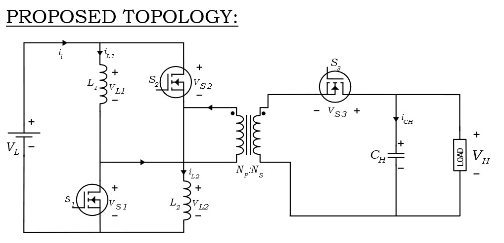
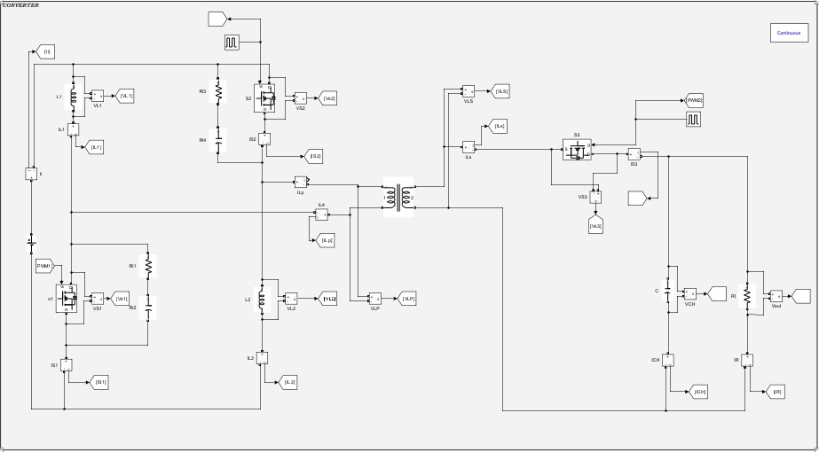
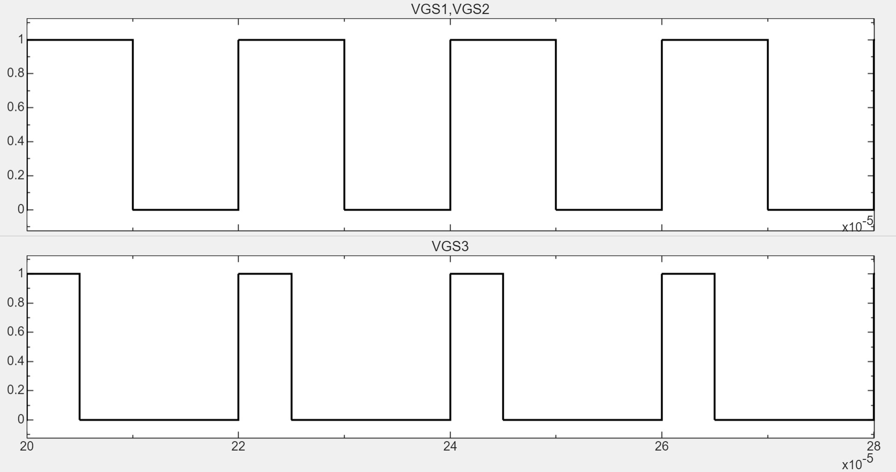
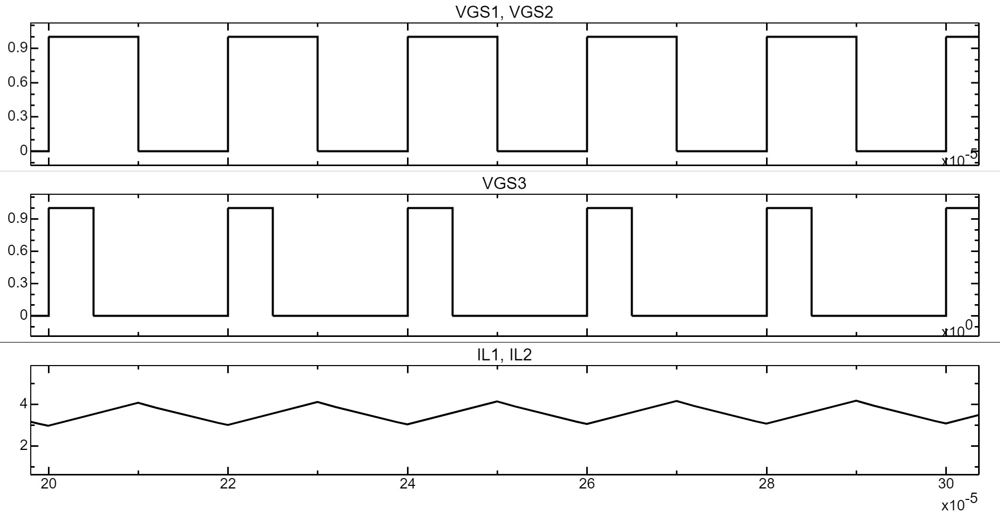
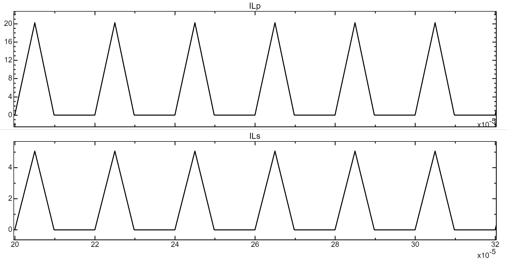
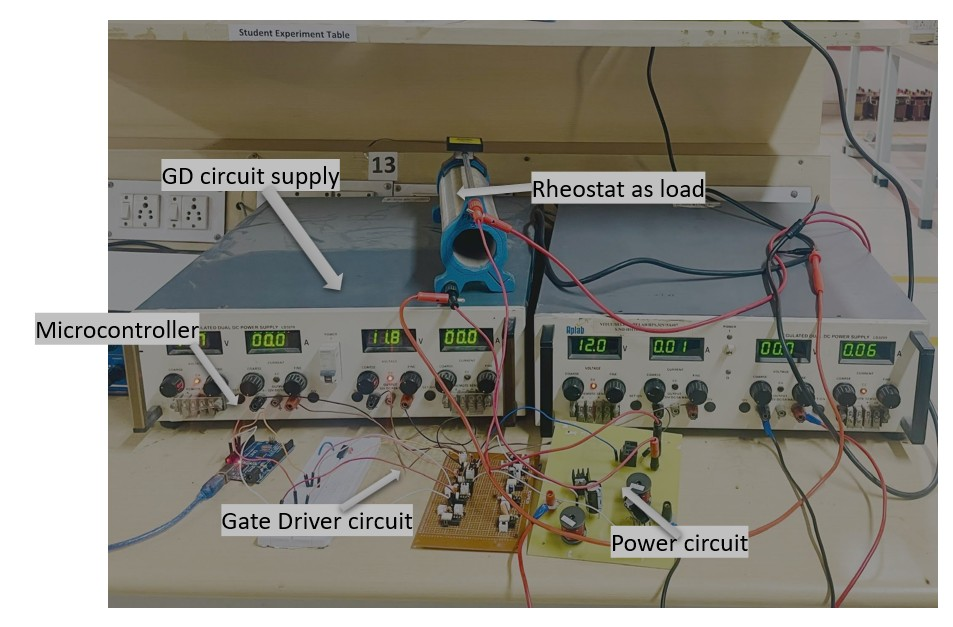
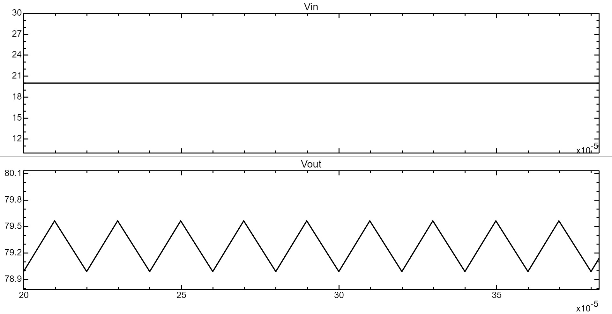
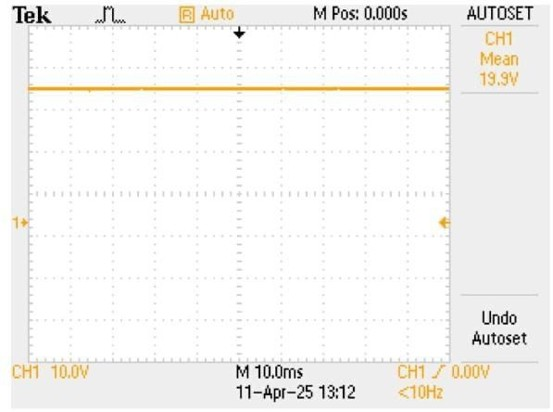
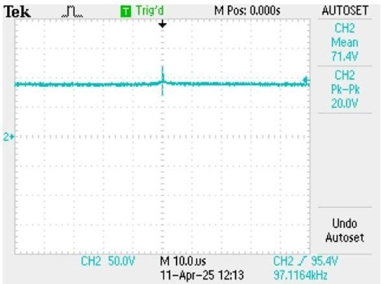

# Isolated DC-DC Converter

Design, simulation, PCB implementation, and experimental evaluation of a
100 W isolated DC-DC converter developed as a Bachelor's thesis project.

## Project Overview

This project focuses on the design and implementation of an isolated DC-DC
converter capable of stepping up a 20 V input to an 80 V output.

The converter was designed for a 100 W output power and a switching frequency
of 100 kHz. MATLAB/Simulink was used to model and simulate the converter,
followed by PCB implementation and hardware testing.

## Key Design Parameters

| Parameter | Value |
|---|---:|
| Input voltage | 20 V |
| Output voltage | 80 V |
| Output power | 100 W |
| Switching frequency | 100 kHz |
| Transformer turns ratio | 1:4 |
| Inductor L1 | 180 µH |
| Inductor L2 | 180 µH |
| Output capacitor CH | 22 µF |
| Switching devices | MOSFETs |

## Converter Topology

The proposed converter consists of three active MOSFET switches (S1, S2, S3),
two equal inductors (L1, L2), a high-frequency transformer, and a high-voltage
output capacitor.

The converter uses a switched-inductor based energy-transfer approach. During
the energy-storage interval, L1 and L2 are charged in parallel from the input
source. During the energy-transfer interval, the stored energy is transferred
through the transformer toward the high-voltage output.

The converter operates through three principal switching modes:

1. **Mode 1 — Energy storage:** S1, S2, and S3 are ON and the inductors
   store energy from the input.
2. **Mode 2 — Continued charging:** S1 and S2 remain ON while S3 is OFF.
   The inductors continue storing energy while the output capacitor supplies
   the load.
3. **Mode 3 — Energy transfer:** The switches are OFF and the stored energy
   in the inductors is transferred toward the output through the transformer.

The switching strategy uses two duty-cycle parameters, D1 and D2. The
documented operating point uses D1 = 0.50 and D2 = 0.25 at a switching
frequency of 100 kHz.

### Converter Topology



## Design Methodology

The design process followed the following sequence:

1. Define the input, output, power, and switching-frequency requirements.
2. Analyse the operating modes of the proposed topology.
3. Determine the required transformer turns ratio.
4. Calculate the required inductance based on the allowable current ripple.
5. Determine the output capacitance from the allowable output-voltage ripple.
6. Select appropriate switching devices and passive components.
7. Develop the MATLAB/Simulink model.
8. Evaluate the simulated electrical waveforms.
9. Implement the converter hardware.
10. Experimentally evaluate the prototype.

## Simulation

The converter was modelled and simulated in MATLAB/Simulink.

The simulation was used to examine the switching behaviour, inductor currents,
transformer currents, and input/output voltage characteristics.

### Simulink Model



### Gate Signals



### Inductor Currents



### Primary and Secondary Currents



## Hardware Implementation

A hardware prototype of the converter was developed and experimentally
evaluated following the simulation and design stages.

The hardware implementation included the power stage, high-frequency
transformer, inductors, switching devices, gate-driver circuitry, and
supporting measurement and power-supply equipment.

### Hardware Setup



## Results

The simulation results were evaluated using the converter's key electrical
waveforms.

### Input and Output Voltage



The simulated converter produces an output voltage close to the 80 V design
target from a 20 V input under the documented operating conditions.

The project specifies an output-voltage ripple target of approximately 1.6 V,
corresponding to 2% of the 80 V output voltage.

### Simulation Results Summary

| Parameter | Documented Result |
|---|---:|
| Input voltage | 20 V |
| Output voltage | ≈80 V |
| Output power | 100 W |
| Switching frequency | 100 kHz |
| Inductor-current ripple target | 0.6 A |
| Output-voltage ripple target | ≈1.6 V |

> **Note:** The values above combine design specifications, ripple targets,
> and simulation results. They should not be interpreted as experimental
> hardware measurements unless explicitly identified as such.

## Experimental Results

The hardware prototype was experimentally evaluated using an oscilloscope.

### Measured Input Voltage



The measured input voltage was approximately **19.9 V**.

### Measured Output Voltage



The measured mean output voltage was approximately **71.4 V**.
The oscilloscope reported a peak-to-peak value of **20.0 V** for the displayed
CH2 waveform.

The measured switching frequency shown by the oscilloscope was approximately
**97.1 kHz**, compared with the nominal design switching frequency of 100 kHz.

### Simulation vs Experimental Observation

| Parameter | Design / Simulation | Experimental |
|---|---:|---:|
| Input voltage | 20 V | 19.9 V |
| Output voltage | 80 V nominal | 71.4 V mean |
| Switching frequency | 100 kHz | 97.1 kHz |

> **Note:** The experimental measurements shown here are taken directly from
> the oscilloscope screenshots. The 20.0 V peak-to-peak value reported for the
> output waveform is not treated as output ripple without further analysis of
> the waveform and measurement conditions.

```text
isolated-dc-dc-converter/
│
├── README.md
│
├── docs/
│   └── project-summary.pdf
│
├── simulation/
│   ├── Main_circuit.slx
│   └── figures/
│
├── hardware/
│   ├── pcb/
│   ├── photos/
│   └── gerbers/
│
└── results/
    └── figures/
